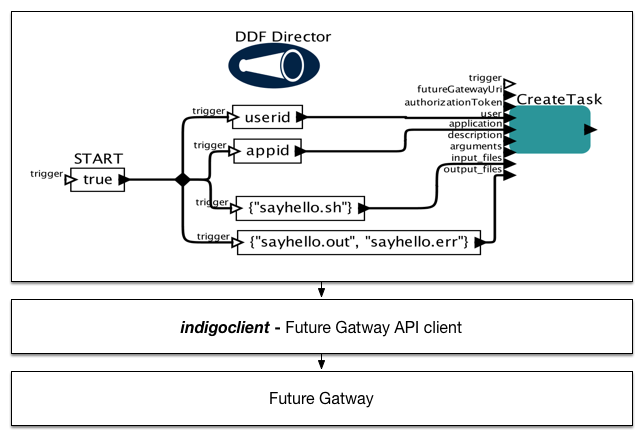

# indigorestclient
Indigo-DC client API is Java based library that can perform calls to Future Gateway API. This library provide basic means for accessing resources provided by Indigo-DC project. It can be used by Java based applications as Future Gateway client.
This library is used by [indigokepler](https://www.gitbook.com/book/indigo-dc/indigokepler) project where each actor works as wrapper for indigoclient classes and their methods.

# Building the library
This repository contains RESTfull client for Indigo based Web Services

To build it call following:

	mvn install

This will produce indigo-fg-api and put jar into local Maven repository.

If you don't want to perform tests, call:

	mvn install -DskipTests -Dcobertura.skip

If you want to call syntax checking, call:

  mvn checkstyle:check cobertura:check

Note that for testing you need access to Future Gateway Web Services.

# CLI client

Indigo-DC CLI client allows to call Future Gateway's API from Command Line Interface. You can run it following way:

       java -cp ./target/indigoAPI.jar pl.psnc.indigo.cli.IndigoClient --help
       
       
